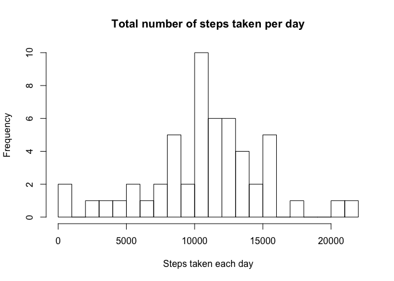
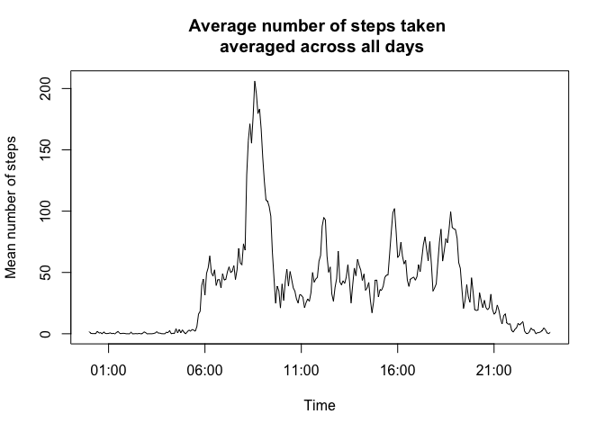
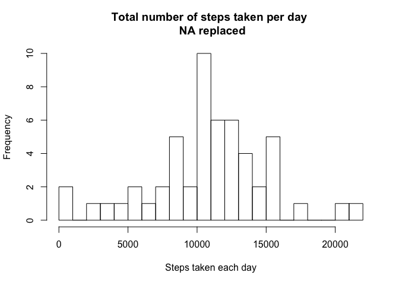
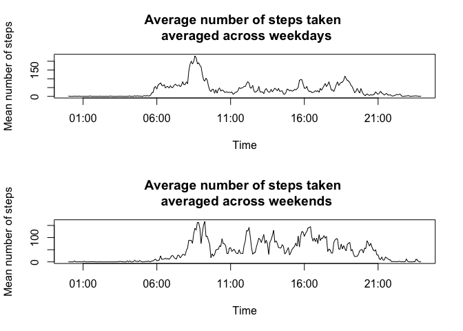

# Reproducible Research: Peer Assessment 1


## Loading and preprocessing the data

We load the data as follows. 

```r
original_data<-read.csv("activity.csv")
```

Next, we make some basic observation on the "NA" data

```r
na_data<-original_data[is.na(original_data$steps),]
library(plyr)
count(na_data$date)
```

```
##            x freq
## 1 2012-10-01  288
## 2 2012-10-08  288
## 3 2012-11-01  288
## 4 2012-11-04  288
## 5 2012-11-09  288
## 6 2012-11-10  288
## 7 2012-11-14  288
## 8 2012-11-30  288
```

Notice that we can divide a 24-hour period into 288 five-minute segments (24x60=5x288). This means that all the missing data come from 24-hour periods of a few selected days.

We remove any cases with "NA" values.

```r
no_na_data<-original_data[complete.cases(original_data),]
```
  
Afterwards, we use tapply to sum the total number or steps for each day.

```r
    sum_each_day<-with(no_na_data,tapply(steps,date,sum))
```
  
Notice that the "sum_each_day" variable contains NA variables, even though we removed the "NA" from the "original_data". This is because the "date" column is a factor, and the missing days are still in the levels of "no_na_data$date" when we use "tapply"


```r
head(sum_each_day)
```

```
## 2012-10-01 2012-10-02 2012-10-03 2012-10-04 2012-10-05 2012-10-06 
##         NA        126      11352      12116      13294      15420
```

```r
head(levels(no_na_data$date))
```

```
## [1] "2012-10-01" "2012-10-02" "2012-10-03" "2012-10-04" "2012-10-05"
## [6] "2012-10-06"
```

## What is mean total number of steps taken per day?


  
We plot the histogram, and find the mean and median of the data.

```r
    hist(sum_each_day,breaks=20,xlab="Steps taken each day", 
         main="Total number of steps taken per day")
```

 

```r
    mean(sum_each_day,na.rm=TRUE)
```

```
## [1] 10766.19
```

```r
    median(sum_each_day,na.rm=TRUE)
```

```
## [1] 10765
```

The mean and median of total number of steps taken per day are 10766.19 and 10765 respectively.


## What is the average daily activity pattern?

First, we find the mean of "steps" within each "interval" using "tapply".

```r
    mean_by_interval<-with(no_na_data,tapply(steps,interval,mean))
```

Next, we manually key in the times using "rep" function, and "paste" together. (We could have also used the column names of "mean_by_interval")


```r
    X<-rep(0:23,each=12)
    Y<-rep(seq(0,55,by=5),24)

    time_unformat<-paste(X,Y,sep=" ")
    head(time_unformat)
```

```
## [1] "0 0"  "0 5"  "0 10" "0 15" "0 20" "0 25"
```

We use "strptime" to convert "time_unformat" into a time format, and then plot the time series graph. 

Remark: We do not care about the day, month, year assigned to the array "nice_time" below. I created the "nice_time" below just to help in plotting.


```r
    ### We only care about hour and minute, and do not care about the date. 
    ### The date assigned to nice_time does not reflect when the data is collected.
    nice_time<-strptime(time_unformat,format="%H %M")
    
    ### Plot
    plot(nice_time,mean_by_interval,type="l",
         main="Average number of steps taken \n averaged across all days",
         xlab="Time",ylab="Mean number of steps")
```

 

The maximum of this graph is "206.1698", and it occurs at "835" (more specifically, "8:35-8:40")


```r
    ### What is the maximum of this graph
    max(mean_by_interval)
```

```
## [1] 206.1698
```

```r
    ### Which time interval has the maximum value. e.g. "835" represents "08:35"

    ### We do not use nice_time, because the date assigned to nice_time
    ### do not reflect when the data is collected.
    names(mean_by_interval)[which(mean_by_interval==max(mean_by_interval))]
```

```
## [1] "835"
```

## Imputing missing values

In our dataset, there are 15264 recorded observation, and 2304 missing observations.

```r
    summary(complete.cases(original_data))
```

```
##    Mode   FALSE    TRUE    NA's 
## logical    2304   15264       0
```

First, we modify and convert the "mean_by_interval" into a data frame, to help with "merge" later.


```r
    numeric_time<-as.numeric(names(mean_by_interval))
    edited_mean<-as.data.frame(cbind(interval=numeric_time,mean=mean_by_interval))
```

Next, we merge it with our "original_data", and fill in the missing values if necessary.

Remark: I am not sure if apply, sapply, tapply is helpful to fill in the missing value. I used a "for" loop.


```r
    copy_data<-merge(original_data,edited_mean,by="interval",sort=FALSE)
    
    ### I don't know how to use apply, sapply, tapply, etc.
    ### I used a for loop
    ### 
    for(i in 1:nrow(copy_data)){
        if(is.na(copy_data$steps[i])){
            copy_data$steps[i]<-copy_data$mean[i]
        }
    }
```

Finally, we sum over each day using "tapply", plot the histogram, and find the mean and median.


```r
    new_sum_each_day<-with(copy_data,tapply(steps,date,sum))
    
    hist(sum_each_day,breaks=20,xlab="Steps taken each day", 
         main="Total number of steps taken per day \n NA replaced")
```

 

```r
    mean(new_sum_each_day,na.rm=TRUE)
```

```
## [1] 10766.19
```

```r
    median(new_sum_each_day,na.rm=TRUE)
```

```
## [1] 10766.19
```
### Sub-discussion:
After replacing the NA values with the corresponding mean from that time interval, the mean stays the same at 10766.19, but the median increases slightly from 10765 to 10766.19.

This is because we used the average to fill in the missing values. Furthermore, missing data spans across a 24-hour period; i.e. there are no days where the morning data is missing but evening data available, and vice versa.

Hence, the "NA-filled-in" data gives the same mean as the "NA-removed" data.

I am guessing that it is a coincidence for the median is equal to mean.

## Are there differences in activity patterns between weekdays and weekends?

After making a second copy of the "NA-filled-in" data, we convert the "copy_data2$date" into a "Date" format, determine and save whether the dates are weekday or weekend.

```r
    copy_data2<-copy_data
    copy_data2$date<-as.Date(copy_data2$date,format="%Y-%m-%d")
    
    ### Determine if weekend
    copy_data2$WEEKEND<-((weekdays(copy_data2$date)) %in% c("Saturday","Sunday"))
```

Next, we convert it into a factor, and reassign the levels for this factor.

Remark: As a reference, "2012-10-01 (2012 Oct 01)" is a Monday. So "WEEKEND" should be "FALSE", and the "FACTOR" should be "weekday". we print the first 6 lines of "copy_data2" to make sure it is OK.


```r
    ### Reference: 2012-10-01 (2012 Oct 01) is a Monday.
    copy_data2$FACTOR<-factor(copy_data2$WEEKEND)
    levels(copy_data2$FACTOR)<-c("weekday","weekend")
    head(copy_data2)    
```

```
##   interval    steps       date     mean WEEKEND  FACTOR
## 1        0 1.716981 2012-10-01 1.716981   FALSE weekday
## 2        0 0.000000 2012-11-23 1.716981   FALSE weekday
## 3        0 0.000000 2012-10-28 1.716981    TRUE weekend
## 4        0 0.000000 2012-11-06 1.716981   FALSE weekday
## 5        0 0.000000 2012-11-24 1.716981    TRUE weekend
## 6        0 0.000000 2012-11-15 1.716981   FALSE weekday
```

Finally, we find the mean based on "interval" and "FACTOR" using "tapply", and plot the time-series graphs.


```r
    day_mean<-with(copy_data2, tapply(steps, list(interval, FACTOR), mean))
    par(mfrow=c(2,1))
    plot(nice_time,day_mean[,1],type="l",
         main="Average number of steps taken \n averaged across weekdays",
         xlab="Time",ylab="Mean number of steps")
    
    plot(nice_time,day_mean[,2],type="l",
         main="Average number of steps taken \n averaged across weekends",
         xlab="Time",ylab="Mean number of steps")
```

 

### Sub-discussion
On average, the number of steps taken during weekend is higher (compared to weekdays) with bigger fluctuation between 11:00-21:00, and lower (compared to weekdays) between 06:00-08:00.


